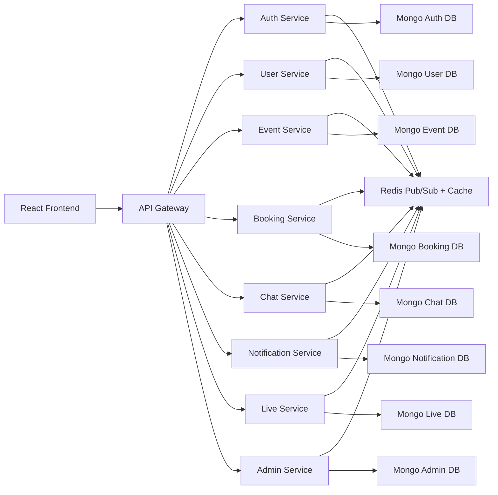

# PulseRoom

PulseRoom is a production-style MERN microservices platform for live and virtual event operations. It combines event discovery, booking and payments, realtime chat, live audience interaction, notifications, and platform administration behind a single gateway.

## Highlights

- Microservices architecture with independent services, isolated MongoDB databases, and Redis-driven domain events
- JWT auth with refresh token rotation, RBAC, and organizer verification workflows
- Realtime event rooms powered by Socket.IO for chat, polls, Q&A, reactions, and admin analytics
- Booking flows with seat controls, payment state management, refunds, and invoice identifiers
- React + Tailwind frontend with organizer dashboard, live event room, booking flow, and admin console

## Repository Layout

```text
api-gateway/
frontend/
packages/
  common/
services/
  auth-service/
  user-service/
  event-service/
  booking-service/
  chat-service/
  notification-service/
  live-service/
  admin-service/
```

## Architecture



## Services

### `api-gateway`
- Single public edge for all REST and websocket traffic
- Simple service discovery via route-to-service map
- Health aggregation and upstream error shaping
- Websocket proxying for `/socket/chat`, `/socket/live`, and `/socket/admin`

### `auth-service`
- Registration and login
- BCrypt password hashing
- JWT access tokens and refresh token rotation with hashed refresh sessions
- RBAC-aware token payloads
- Event publication on user registration

### `user-service`
- Profile CRUD
- Role and permission management
- Organizer verification requests and approval flow
- Read model for recommendation context

### `event-service`
- Event lifecycle, ticket tiers, sessions, speakers, visibility, and publication
- Search filters and recommendation scoring
- Organizer dashboard data
- Revenue and attendee counters updated from booking events

### `booking-service`
- Booking checkout with seat limit enforcement
- Stripe-ready payment intent path plus `manual` provider for local development
- Refund support
- Invoice identifier generation
- Booking events emitted for downstream notifications and analytics

### `chat-service`
- Event group chat and private room support
- Persistent message history
- Mute and ban restrictions
- Message deletion and moderation events

### `notification-service`
- In-app notifications
- Email delivery via Nodemailer
- Delayed reminders via BullMQ on Redis
- Audience projection for event-wide update broadcasts

### `live-service`
- Live polls, votes, Q&A, announcements, and emoji reactions
- Realtime websocket room per event
- Durable poll and question state in MongoDB

### `admin-service`
- Analytics read model maintained from domain events
- Realtime admin dashboard updates over Socket.IO
- Reporting and moderation workflows
- User bans and event moderation orchestration

## Event-Driven Flows

- `user.registered` -> user profile bootstrap
- `user.updated` -> auth role/permission sync
- `booking.created` -> analytics and orchestration hook
- `payment.succeeded` -> booking confirmation
- `booking.confirmed` -> event attendee counters, notification fanout, reminder scheduling
- `payment.refunded` -> revenue rollback
- `event.updated` -> attendee notifications
- `chat.message.sent` -> admin analytics counters
- `poll.response` and `question.posted` -> live analytics counters

## Database Design

### Auth DB
- `UserCredential`
  - unique: `userId`, `email`
  - indexed: `role`, `isActive`
- `RefreshToken`
  - indexed: `userId`, `tokenHash`
  - TTL index: `expiresAt`

### User DB
- `UserProfile`
  - unique: `userId`
  - indexed: `email`, `role`, `verifiedOrganizer`, `isActive`
  - text index: `displayName`, `bio`, `interests`
- `OrganizerVerificationRequest`
  - indexed: `userId`, `status`

### Event DB
- `Event`
  - indexed: `organizerId`, `slug`, `type`, `visibility`, `status`, `startsAt`, `categories`, `tags`, `liveStatus`
  - text index: `title`, `summary`, `description`, `categories`, `tags`
  - embedded subdocuments: `sessions`, `speakers`, `ticketTiers`

### Booking DB
- `Booking`
  - unique: `bookingNumber`
  - indexed: `userId`, `eventId`, `tierId`, `status`, `reservationExpiresAt`
- `Payment`
  - indexed: `bookingId`, `userId`, `eventId`, `providerPaymentId`, `status`

### Chat DB
- `Message`
  - indexed: `roomType`, `roomId`, `eventId`, `senderId`, `createdAt`
- `ChatRestriction`
  - indexed: `eventId`, `userId`, `type`

### Notification DB
- `Notification`
  - indexed: `userId`, `eventId`, `channel`, `type`, `readAt`
- `EventAudience`
  - unique compound index: `eventId + userId`

### Live DB
- `Poll`
  - indexed: `eventId`, `status`
- `Question`
  - indexed: `eventId`, `userId`
- `Announcement`
  - indexed: `eventId`
- `ReactionCounter`
  - unique compound index: `eventId + emoji`

### Admin DB
- `AnalyticsSnapshot`
  - unique: `scope`
- `ModerationReport`
  - indexed: `reportType`, `targetId`, `status`
- `BanRecord`
  - indexed: `userId`, `active`

## Security Controls

- Helmet headers on every service
- CORS with credentials support
- Express rate limiting
- Mongo query sanitization and HPP protection
- JWT verification middleware shared across services
- SameSite `strict`, `httpOnly` refresh token cookie
- Stripe webhook raw-body preservation for secure verification

## Frontend Surfaces

- `/` event discovery and recommendations
- `/auth` sign-in and registration
- `/events/:eventId` detailed event view and booking flow
- `/events/:eventId/live` live room with chat, polls, Q&A, announcements, and reactions
- `/dashboard` organizer dashboard with event creation and publication
- `/admin` live analytics and moderation view

## Local Environment

### Prerequisites

- Node.js 20+
- npm 10+
- Docker Desktop if you want the full containerized stack

### Environment

1. Copy `.env.example` to `.env`
2. Update the JWT secrets
3. Leave `PAYMENT_PROVIDER=manual` for local development unless Stripe credentials are configured

## Running Locally With npm

1. Ensure MongoDB and Redis are running on `localhost`
2. Install dependencies:

   ```bash
   npm install
   ```

3. Start the full stack:

   ```bash
   npm run dev
   ```

4. Open:
   - frontend: `http://localhost:5173`
   - gateway: `http://localhost:8080`

## Running With Docker Compose

1. Start Docker Desktop
2. Build and run everything:

   ```bash
   docker compose up --build
   ```

3. Open:
   - frontend: `http://localhost:5173`
   - gateway: `http://localhost:8080`
   - MailHog: `http://localhost:8025`

## Verification Commands

```bash
npm test
npm run build --workspace frontend
docker compose config
```

## Current Test Coverage

- Auth service API smoke test with `supertest`
- Unit tests for organizer permission mapping
- Unit tests for event slug generation
- Unit tests for invoice number generation
- Frontend production build verification

## Notes

- The booking service is Stripe-ready but defaults to `manual` payment mode for local runs.
- Docker Compose is configured with container-aware service hostnames, while `.env.example` targets local non-container development.
- Private chat backend APIs are implemented even though the current frontend emphasizes group event rooms first.
